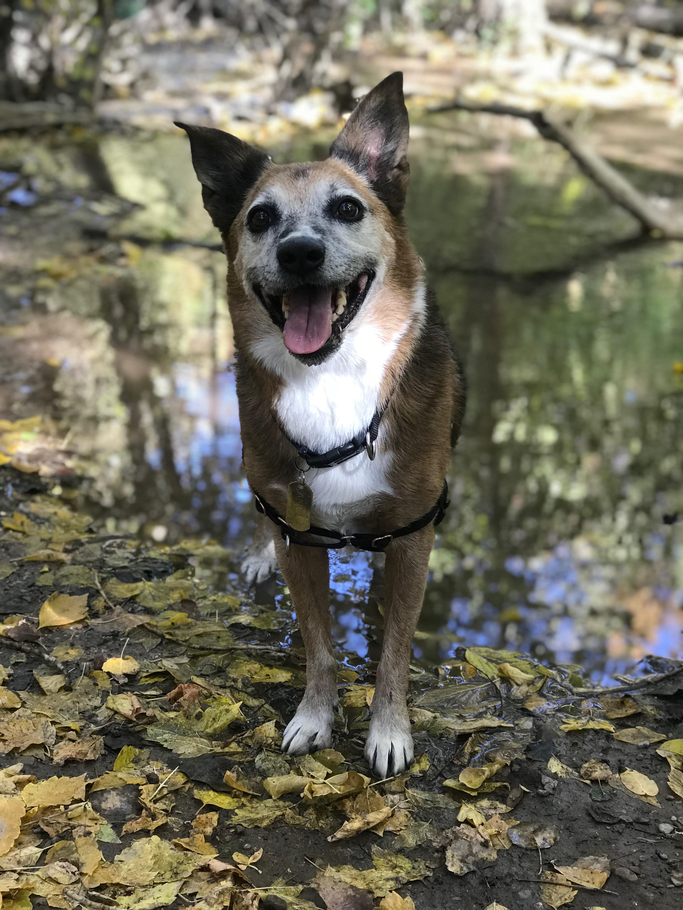

## 👤 About Me
I'm a Software Engineer with over a decade of experience building backend systems and data pipelines. Recently, I’ve been exploring ways to reconnect with the natural world by diving into geography, mapping, and environmental data. This account documents that journey and is dedicated to spatial analysis, open geodata, and GIS experimentation.

### 🐺 In Memory of Angus
This project and anything else I create in this space, should I continue - is dedicated to my dog Angus. I’ll carry you with me as I learn, grow, and explore the world through maps.

# 🐾 Pawximity
**Dog-friendly trails near water in Salt Lake County, Utah.**
A geospatial analysis and mapping project built using QGIS, PostGIS, and open data.

## 📍 About This Project
**Pawximity** helps locate hiking and walking trails that are:
- Dog-friendly 🐶
- Within close proximity to water sources 💧
- Mapped with open GIS tools and public datasets 🗺️

### Work in Progress
